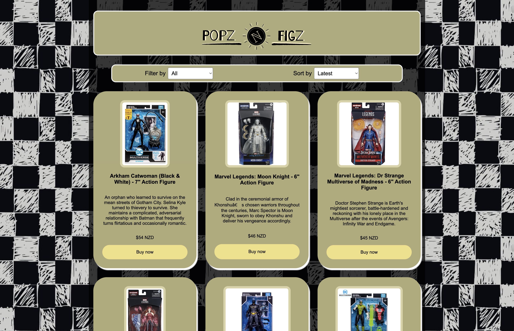

# 01 Project - Online Shop

This project is an online shop called Popz N' Figz that sells a variety of pop vinyls, action figures and other collections.

## Dependencies of the App

This project uses the following systems to work properly:

- [Stripe](https://stripe.com/)
- [Begin](http://begin.com/)
- [ReactJS](https://react.dev/)
- [NodeJS](https://nodejs.org/)
- [NPM](https://www.npmjs.com/)

## Prerequisites

- You need [NodeJS](https://nodejs.org/) to run this application.

## Local Development Instructions

Instructions upon opening this repository:

1. Open/clone repository from GitHub.
2. Run `npm install`.
3. Run `npm start` to start the development server.
4. Open `src/App.js` to get started.

## Deployed Applications

-
-
